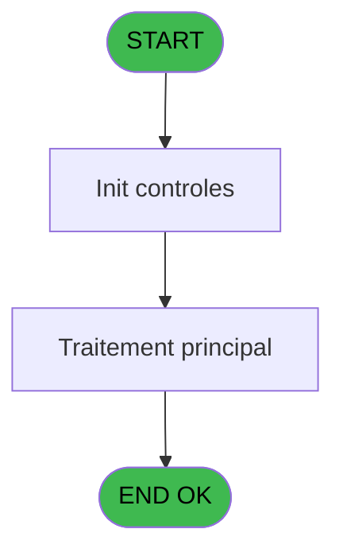
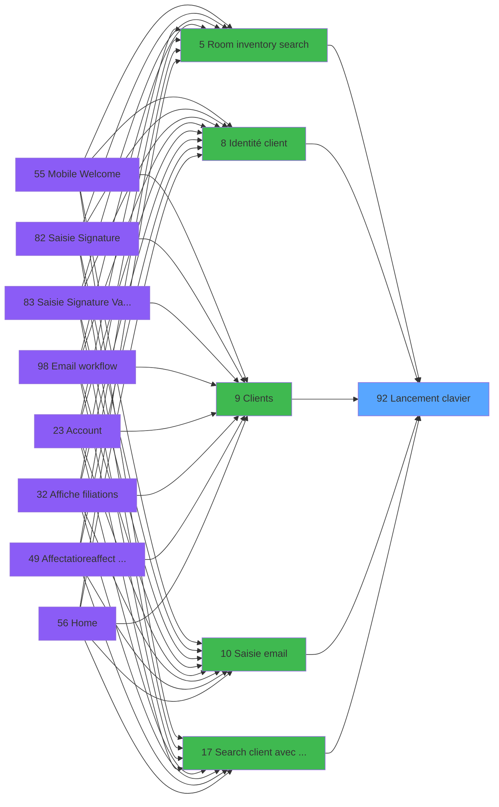

# WEL IDE 92 - Lancement clavier

> **Analyse**: Phases 1-4 2026-02-03 21:41 -> 21:42 (17s) | Assemblage 21:42
> **Pipeline**: V7.2 Enrichi
> **Structure**: 4 onglets (Resume | Ecrans | Donnees | Connexions)

<!-- TAB:Resume -->

## 1. FICHE D'IDENTITE

| Attribut | Valeur |
|----------|--------|
| Projet | WEL |
| IDE Position | 92 |
| Nom Programme | Lancement clavier |
| Fichier source | `Prg_92.xml` |
| Dossier IDE | Utilitaires |
| Taches | 1 (0 ecrans visibles) |
| Tables modifiees | 0 |
| Programmes appeles | 0 |

## 2. DESCRIPTION FONCTIONNELLE

**Lancement clavier** assure la gestion complete de ce processus, accessible depuis [Identité client (IDE 8)](WEL-IDE-8.md), [Room inventory search (IDE 5)](WEL-IDE-5.md), [Logon (IDE 54)](WEL-IDE-54.md), [Search client avec liste (IDE 17)](WEL-IDE-17.md), [Messages (IDE 57)](WEL-IDE-57.md), [Clients (IDE 9)](WEL-IDE-9.md), [Saisie email (IDE 10)](WEL-IDE-10.md), [Workflow checkin (IDE 97)](WEL-IDE-97.md).

Le flux de traitement s'organise en **1 blocs fonctionnels** :

- **Traitement** (1 tache) : traitements metier divers

## 3. BLOCS FONCTIONNELS

### 3.1 Traitement (1 tache)

Traitements internes.

---

#### 92 - Lancement clavier

**Role** : Traitement : Lancement clavier.

## 5. REGLES METIER

*(Aucune regle metier identifiee)*

## 6. CONTEXTE

- **Appele par**: [Identité client (IDE 8)](WEL-IDE-8.md), [Room inventory search (IDE 5)](WEL-IDE-5.md), [Logon (IDE 54)](WEL-IDE-54.md), [Search client avec liste (IDE 17)](WEL-IDE-17.md), [Messages (IDE 57)](WEL-IDE-57.md), [Clients (IDE 9)](WEL-IDE-9.md), [Saisie email (IDE 10)](WEL-IDE-10.md), [Workflow checkin (IDE 97)](WEL-IDE-97.md)
- **Appelle**: 0 programmes | **Tables**: 0 (W:0 R:0 L:0) | **Taches**: 1 | **Expressions**: 0

<!-- TAB:Ecrans -->

## 8. ECRANS

*(Programme sans ecran visible)*

## 9. NAVIGATION

### 9.3 Structure hierarchique (1 tache)

| Position | Tache | Type | Dimensions | Bloc |
|----------|-------|------|------------|------|
| **92.1** | [**Lancement clavier** (92)](#t1) | - | - | Traitement |

### 9.4 Algorigramme

> **Legende**: Vert = START/END OK | Rouge = END KO | Bleu = Decisions
> *Algorigramme auto-genere. Utiliser `/algorigramme` pour une synthese metier detaillee.*

<!-- TAB:Donnees -->

## 10. TABLES

### Tables utilisees (0)

| ID | Nom | Description | Type | R | W | L | Usages |
|----|-----|-------------|------|---|---|---|--------|

### Colonnes par table (0 / 0 tables avec colonnes identifiees)

## 11. VARIABLES

*(Programme sans variables locales mappees)*

## 12. EXPRESSIONS

**0 / 0 expressions decodees (0%)**

### 12.1 Repartition par type

| Type | Expressions | Regles |
|------|-------------|--------|

### 12.2 Expressions cles par type

<!-- TAB:Connexions -->

## 13. GRAPHE D'APPELS

### 13.1 Chaine depuis Main (Callers)

Main -> ... -> [Identité client (IDE 8)](WEL-IDE-8.md) -> **Lancement clavier (IDE 92)**

Main -> ... -> [Room inventory search (IDE 5)](WEL-IDE-5.md) -> **Lancement clavier (IDE 92)**

Main -> ... -> [Logon (IDE 54)](WEL-IDE-54.md) -> **Lancement clavier (IDE 92)**

Main -> ... -> [Search client avec liste (IDE 17)](WEL-IDE-17.md) -> **Lancement clavier (IDE 92)**

Main -> ... -> [Messages (IDE 57)](WEL-IDE-57.md) -> **Lancement clavier (IDE 92)**

Main -> ... -> [Clients (IDE 9)](WEL-IDE-9.md) -> **Lancement clavier (IDE 92)**

Main -> ... -> [Saisie email (IDE 10)](WEL-IDE-10.md) -> **Lancement clavier (IDE 92)**

Main -> ... -> [Workflow checkin (IDE 97)](WEL-IDE-97.md) -> **Lancement clavier (IDE 92)**

### 13.2 Callers

| IDE | Nom Programme | Nb Appels |
|-----|---------------|-----------|
| [8](WEL-IDE-8.md) | Identité client | 12 |
| [5](WEL-IDE-5.md) | Room inventory search | 7 |
| [54](WEL-IDE-54.md) | Logon | 4 |
| [17](WEL-IDE-17.md) | Search client avec liste | 3 |
| [57](WEL-IDE-57.md) | Messages | 2 |
| [9](WEL-IDE-9.md) | Clients | 1 |
| [10](WEL-IDE-10.md) | Saisie email | 1 |
| [97](WEL-IDE-97.md) | Workflow checkin | 1 |

### 13.3 Callees (programmes appeles)

### 13.4 Detail Callees avec contexte

| IDE | Nom Programme | Appels | Contexte |
|-----|---------------|--------|----------|
| - | (aucun) | - | - |

## 14. RECOMMANDATIONS MIGRATION

### 14.1 Profil du programme

| Metrique | Valeur | Impact migration |
|----------|--------|-----------------|
| Lignes de logique | 2 | Programme compact |
| Expressions | 0 | Peu de logique |
| Tables WRITE | 0 | Impact faible |
| Sous-programmes | 0 | Peu de dependances |
| Ecrans visibles | 0 | Ecran unique ou traitement batch |
| Code desactive | 0% (0 / 2) | Code sain |
| Regles metier | 0 | Pas de regle identifiee |

### 14.2 Plan de migration par bloc

#### Traitement (1 tache: 0 ecran, 1 traitement)

- **Strategie** : 1 service(s) backend injectable(s) (Domain Services).
- Decomposer les taches en services unitaires testables.

### 14.3 Dependances critiques

| Dependance | Type | Appels | Impact |
|------------|------|--------|--------|

---
*Spec DETAILED generee par Pipeline V7.2 - 2026-02-03 21:42*
