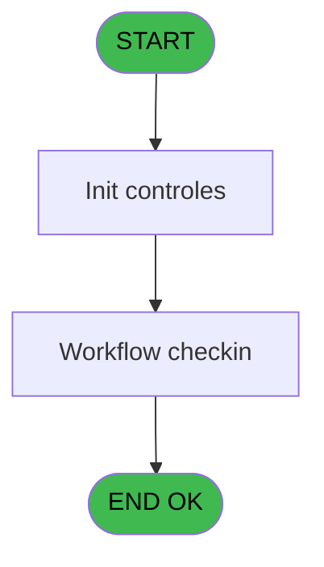
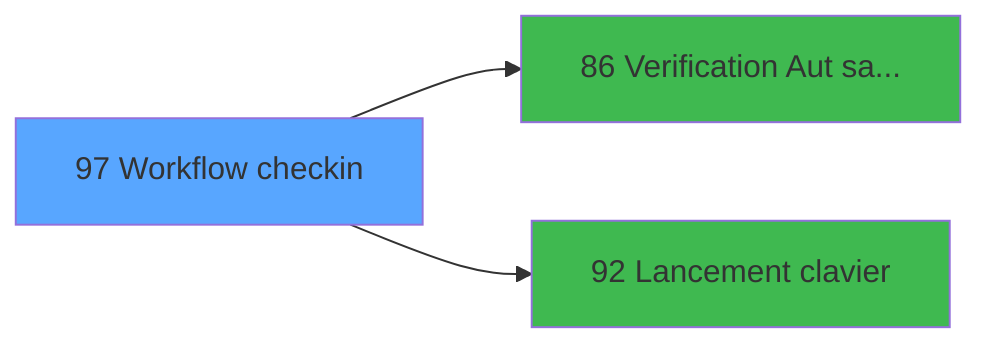

# WEL IDE 97 - Workflow checkin

> **Analyse**: Phases 1-4 2026-02-03 21:44 -> 21:44 (17s) | Assemblage 21:44
> **Pipeline**: V7.2 Enrichi
> **Structure**: 4 onglets (Resume | Ecrans | Donnees | Connexions)

<!-- TAB:Resume -->

## 1. FICHE D'IDENTITE

| Attribut | Valeur |
|----------|--------|
| Projet | WEL |
| IDE Position | 97 |
| Nom Programme | Workflow checkin |
| Fichier source | `Prg_97.xml` |
| Dossier IDE | Workflow |
| Taches | 12 (1 ecrans visibles) |
| Tables modifiees | 0 |
| Programmes appeles | 2 |
| :warning: Statut | **ORPHELIN_POTENTIEL** |

## 2. DESCRIPTION FONCTIONNELLE

**Workflow checkin** assure la gestion complete de ce processus.

Le flux de traitement s'organise en **4 blocs fonctionnels** :

- **Traitement** (8 taches) : traitements metier divers
- **Initialisation** (2 taches) : reinitialisation d'etats et de variables de travail
- **Creation** (1 tache) : insertion d'enregistrements en base (mouvements, prestations)
- **Calcul** (1 tache) : calculs de montants, stocks ou compteurs

Detail : phases du traitement

#### Phase 1 : Traitement (8 taches)

- **97.1** - Workflow checkin **[[ECRAN]](#ecran-t1)**
- **97.1.1** - MaJ autre filiation
- **97** - (sans nom)
- **97.3.1** - Maj tache
- **97.4** - Maj tache
- **97.5** - Maj tache
- **97.6.1** - Maj tache
- **97.7** - Maj tache

Delegue a : [Lancement clavier (IDE 92)](WEL-IDE-92.md)

#### Phase 2 : Initialisation (2 taches)

- **97.1.2** - Initialise encode
- **97.2** - Initialise tache

#### Phase 3 : Calcul (1 tache)

- **97.3** - Compte filiation **[[ECRAN]](#ecran-t14)**

#### Phase 4 : Creation (1 tache)

- **97.6** - Creat Club Med Pass

## 3. BLOCS FONCTIONNELS

### 3.1 Traitement (8 taches)

Traitements internes.

---

#### 97.1 - Workflow checkin [[ECRAN]](#ecran-t1)

**Role** : Tache d'orchestration : point d'entree du programme (8 sous-taches). Coordonne l'enchainement des traitements.
**Ecran** : 1313 x 744 DLU | [Voir mockup](#ecran-t1)

7 sous-taches directes

| Tache | Nom | Bloc |
|-------|-----|------|
| [97.1.1](#t5) | MaJ autre filiation | Traitement |
| [97](#t7) | (sans nom) | Traitement |
| [97.3.1](#t15) | Maj tache | Traitement |
| [97.4](#t18) | Maj tache | Traitement |
| [97.5](#t31) | Maj tache | Traitement |
| [97.6.1](#t40) | Maj tache | Traitement |
| [97.7](#t43) | Maj tache | Traitement |

**Delegue a** : [Lancement clavier (IDE 92)](WEL-IDE-92.md)

---

#### 97.1.1 - MaJ autre filiation

**Role** : Traitement : MaJ autre filiation.
**Variables liees** : C (V0.Compteur filiation), D (V0.Compteur filiation validee)
**Delegue a** : [Lancement clavier (IDE 92)](WEL-IDE-92.md)

---

#### 97 - (sans nom)

**Role** : Traitement interne.
**Delegue a** : [Lancement clavier (IDE 92)](WEL-IDE-92.md)

---

#### 97.3.1 - Maj tache

**Role** : Traitement : Maj tache.
**Delegue a** : [Lancement clavier (IDE 92)](WEL-IDE-92.md)

---

#### 97.4 - Maj tache

**Role** : Traitement : Maj tache.
**Delegue a** : [Lancement clavier (IDE 92)](WEL-IDE-92.md)

---

#### 97.5 - Maj tache

**Role** : Traitement : Maj tache.
**Delegue a** : [Lancement clavier (IDE 92)](WEL-IDE-92.md)

---

#### 97.6.1 - Maj tache

**Role** : Traitement : Maj tache.
**Delegue a** : [Lancement clavier (IDE 92)](WEL-IDE-92.md)

---

#### 97.7 - Maj tache

**Role** : Traitement : Maj tache.
**Delegue a** : [Lancement clavier (IDE 92)](WEL-IDE-92.md)

### 3.2 Initialisation (2 taches)

Reinitialisation d'etats et variables de travail.

---

#### 97.1.2 - Initialise encode

**Role** : Reinitialisation : Initialise encode.

---

#### 97.2 - Initialise tache

**Role** : Reinitialisation : Initialise tache.

### 3.3 Calcul (1 tache)

Calculs metier : montants, stocks, compteurs.

---

#### 97.3 - Compte filiation [[ECRAN]](#ecran-t14)

**Role** : Traitement : Compte filiation.
**Ecran** : 120 x 195 DLU | [Voir mockup](#ecran-t14)
**Variables liees** : C (V0.Compteur filiation), D (V0.Compteur filiation validee)

### 3.4 Creation (1 tache)

Insertion de nouveaux enregistrements en base.

---

#### 97.6 - Creat Club Med Pass

**Role** : Traitement : Creat Club Med Pass.

## 5. REGLES METIER

*(Aucune regle metier identifiee)*

## 6. CONTEXTE

- **Appele par**: (aucun)
- **Appelle**: 2 programmes | **Tables**: 9 (W:0 R:8 L:2) | **Taches**: 12 | **Expressions**: 11

<!-- TAB:Ecrans -->

## 8. ECRANS

### 8.1 Forms visibles (1 / 12)

| # | Position | Tache | Nom | Type | Largeur | Hauteur | Bloc |
|---|----------|-------|-----|------|---------|---------|------|
| 1 | 97 | 97.1 | Workflow checkin | Type0 | 1313 | 744 | Traitement |

### 8.2 Mockups Ecrans

---

#### 97 - Workflow checkin
**Tache** : [97.1](#t1) | **Type** : Type0 | **Dimensions** : 1313 x 744 DLU
**Bloc** : Traitement | **Titre IDE** : Workflow checkin

<!-- FORM-DATA:
{
    "width":  1313,
    "vFactor":  100,
    "type":  "Type0",
    "hFactor":  100,
    "controls":  [
                     {
                         "x":  182,
                         "type":  "label",
                         "var":  "",
                         "y":  0,
                         "w":  1130,
                         "fmt":  "",
                         "name":  "",
                         "h":  66,
                         "color":  "212",
                         "text":  "CHECK IN",
                         "parent":  null
                     },
                     {
                         "x":  1137,
                         "type":  "label",
                         "var":  "",
                         "y":  69,
                         "w":  175,
                         "fmt":  "",
                         "name":  "",
                         "h":  675,
                         "color":  "212",
                         "text":  "",
                         "parent":  null
                     },
                     {
                         "x":  25,
                         "type":  "label",
                         "var":  "",
                         "y":  84,
                         "w":  245,
                         "fmt":  "",
                         "name":  "",
                         "h":  24,
                         "color":  "",
                         "text":  "ACTION",
                         "parent":  null
                     },
                     {
                         "x":  277,
                         "type":  "label",
                         "var":  "",
                         "y":  84,
                         "w":  510,
                         "fmt":  "",
                         "name":  "",
                         "h":  24,
                         "color":  "",
                         "text":  "COMMENT",
                         "parent":  null
                     },
                     {
                         "x":  794,
                         "type":  "label",
                         "var":  "",
                         "y":  84,
                         "w":  106,
                         "fmt":  "",
                         "name":  "",
                         "h":  24,
                         "color":  "",
                         "text":  "DATE",
                         "parent":  null
                     },
                     {
                         "x":  909,
                         "type":  "label",
                         "var":  "",
                         "y":  84,
                         "w":  108,
                         "fmt":  "",
                         "name":  "",
                         "h":  24,
                         "color":  "",
                         "text":  "TIME",
                         "parent":  null
                     },
                     {
                         "x":  1025,
                         "type":  "label",
                         "var":  "",
                         "y":  84,
                         "w":  95,
                         "fmt":  "",
                         "name":  "",
                         "h":  24,
                         "color":  "",
                         "text":  "USER",
                         "parent":  null
                     },
                     {
                         "x":  19,
                         "type":  "table",
                         "var":  "",
                         "name":  "",
                         "titleH":  12,
                         "color":  "226",
                         "w":  1108,
                         "y":  107,
                         "fmt":  "",
                         "parent":  null,
                         "text":  "",
                         "rowH":  56,
                         "h":  621,
                         "cols":  [
                                      {
                                          "title":  "NAME",
                                          "layer":  1,
                                          "w":  253
                                      },
                                      {
                                          "title":  "FIRST NAME",
                                          "layer":  2,
                                          "w":  519
                                      },
                                      {
                                          "title":  "QUAL",
                                          "layer":  3,
                                          "w":  110
                                      },
                                      {
                                          "title":  "",
                                          "layer":  4,
                                          "w":  119
                                      },
                                      {
                                          "title":  "",
                                          "layer":  5,
                                          "w":  99
                                      }
                                  ],
                         "rows":  5
                     },
                     {
                         "x":  0,
                         "type":  "image",
                         "var":  "",
                         "y":  0,
                         "w":  173,
                         "fmt":  "",
                         "name":  "RETOUR",
                         "h":  66,
                         "color":  "226",
                         "text":  "",
                         "parent":  null
                     },
                     {
                         "x":  1146,
                         "type":  "edit",
                         "var":  "",
                         "y":  75,
                         "w":  159,
                         "fmt":  "30",
                         "name":  "SEARCH_CLIENT",
                         "h":  79,
                         "color":  "214",
                         "text":  "",
                         "parent":  null
                     },
                     {
                         "x":  26,
                         "type":  "edit",
                         "var":  "",
                         "y":  111,
                         "w":  245,
                         "fmt":  "",
                         "name":  "BOUTON",
                         "h":  44,
                         "color":  "230",
                         "text":  "",
                         "parent":  10
                     },
                     {
                         "x":  277,
                         "type":  "edit",
                         "var":  "",
                         "y":  111,
                         "w":  510,
                         "fmt":  "",
                         "name":  "tas_commentaire",
                         "h":  44,
                         "color":  "220",
                         "text":  "",
                         "parent":  10
                     },
                     {
                         "x":  794,
                         "type":  "edit",
                         "var":  "",
                         "y":  111,
                         "w":  106,
                         "fmt":  "##/##/####Z",
                         "name":  "tas_date",
                         "h":  44,
                         "color":  "220",
                         "text":  "",
                         "parent":  10
                     },
                     {
                         "x":  909,
                         "type":  "edit",
                         "var":  "",
                         "y":  111,
                         "w":  108,
                         "fmt":  "HH:MMZ",
                         "name":  "tas_time",
                         "h":  44,
                         "color":  "220",
                         "text":  "",
                         "parent":  10
                     },
                     {
                         "x":  1025,
                         "type":  "edit",
                         "var":  "",
                         "y":  111,
                         "w":  95,
                         "fmt":  "",
                         "name":  "tas_user",
                         "h":  44,
                         "color":  "220",
                         "text":  "",
                         "parent":  10
                     }
                 ],
    "taskId":  "97",
    "height":  744
}
-->

<strong>Champs : 6 champs</strong>

| Pos (x,y) | Nom | Variable | Type |
|-----------|-----|----------|------|
| 1146,75 | SEARCH_CLIENT | - | edit |
| 26,111 | BOUTON | - | edit |
| 277,111 | tas_commentaire | - | edit |
| 794,111 | tas_date | - | edit |
| 909,111 | tas_time | - | edit |
| 1025,111 | tas_user | - | edit |

## 9. NAVIGATION

Ecran unique: **Workflow checkin**

### 9.3 Structure hierarchique (12 taches)

| Position | Tache | Type | Dimensions | Bloc |
|----------|-------|------|------------|------|
| **97.1** | [**Workflow checkin** (97.1)](#t1) [mockup](#ecran-t1) | - | 1313x744 | Traitement |
| 97.1.1 | [MaJ autre filiation (97.1.1)](#t5) | - | - | |
| 97.1.2 | [(sans nom) (97)](#t7) | - | - | |
| 97.1.3 | [Maj tache (97.3.1)](#t15) | - | - | |
| 97.1.4 | [Maj tache (97.4)](#t18) | - | - | |
| 97.1.5 | [Maj tache (97.5)](#t31) | - | - | |
| 97.1.6 | [Maj tache (97.6.1)](#t40) | - | - | |
| 97.1.7 | [Maj tache (97.7)](#t43) | - | - | |
| **97.2** | [**Initialise encode** (97.1.2)](#t6) | - | - | Initialisation |
| 97.2.1 | [Initialise tache (97.2)](#t11) | - | - | |
| **97.3** | [**Compte filiation** (97.3)](#t14) [mockup](#ecran-t14) | - | 120x195 | Calcul |
| **97.4** | [**Creat Club Med Pass** (97.6)](#t34) | - | - | Creation |

### 9.4 Algorigramme

> **Legende**: Vert = START/END OK | Rouge = END KO | Bleu = Decisions
> *Algorigramme auto-genere. Utiliser `/algorigramme` pour une synthese metier detaillee.*

<!-- TAB:Donnees -->

## 10. TABLES

### Tables utilisees (9)

| ID | Nom | Description | Type | R | W | L | Usages |
|----|-----|-------------|------|---|---|---|--------|
| 30 | gm-recherche_____gmr | Index de recherche | DB | R |   |   | 1 |
| 31 | gm-complet_______gmc |  | DB | R |   |   | 1 |
| 39 | depot_garantie___dga | Depots et garanties | DB | R |   |   | 1 |
| 80 | codes_autocom____aut |  | DB | R |   |   | 1 |
| 131 | fichier_validation |  | DB | R |   | L | 5 |
| 285 | email |  | DB | R |   |   | 1 |
| 312 | ez_card |  | DB | R |   |   | 2 |
| 918 | stype_tm |  | DB | R |   |   | 1 |
| 919 | Table_919 |  | MEM |   |   | L | 8 |

### Colonnes par table (4 / 8 tables avec colonnes identifiees)

Table 30 - gm-recherche_____gmr (R) - 1 usages

*Table utilisee uniquement en Link ou aucune colonne Real identifiee dans le DataView.*

Table 31 - gm-complet_______gmc (R) - 1 usages

*Table utilisee uniquement en Link ou aucune colonne Real identifiee dans le DataView.*

Table 39 - depot_garantie___dga (R) - 1 usages

*Table utilisee uniquement en Link ou aucune colonne Real identifiee dans le DataView.*

Table 80 - codes_autocom____aut (R) - 1 usages

*Table utilisee uniquement en Link ou aucune colonne Real identifiee dans le DataView.*

Table 131 - fichier_validation (R/L) - 5 usages

| Lettre | Variable | Acces | Type |
|--------|----------|-------|------|
| A | V1.Compte filiation | R | Numeric |
| B | V1.Compte filiation validee | R | Numeric |

Table 285 - email (R) - 1 usages

| Lettre | Variable | Acces | Type |
|--------|----------|-------|------|
| A | V1.existe email ? | R | Logical |
| B | V1.existe phone ? | R | Logical |

Table 312 - ez_card (R) - 2 usages

| Lettre | Variable | Acces | Type |
|--------|----------|-------|------|
| A | V.Nb card | R | Numeric |

Table 918 - stype_tm (R) - 1 usages

| Lettre | Variable | Acces | Type |
|--------|----------|-------|------|
| A | P.Refresh screen | R | Logical |
| B | V.Color bouton | R | Numeric |
| C | V0.Compteur filiation | R | Numeric |
| D | V0.Compteur filiation validee | R | Numeric |
| E | V0.Date | R | Date |
| F | V0.Time | R | Time |
| G | V0.Autorisation | R | Alpha |

## 11. VARIABLES

### 11.1 Parametres entrants (1)

Variables recues en parametre.

| Lettre | Nom | Type | Usage dans |
|--------|-----|------|-----------|
| A | P.Refresh screen | Logical | - |

### 11.2 Variables de session (1)

Variables persistantes pendant toute la session.

| Lettre | Nom | Type | Usage dans |
|--------|-----|------|-----------|
| B | V.Color bouton | Numeric | - |

### 11.3 Autres (5)

Variables diverses.

| Lettre | Nom | Type | Usage dans |
|--------|-----|------|-----------|
| C | V0.Compteur filiation | Numeric | - |
| D | V0.Compteur filiation validee | Numeric | - |
| E | V0.Date | Date | - |
| F | V0.Time | Time | - |
| G | V0.Autorisation | Alpha | 1x refs |

## 12. EXPRESSIONS

**11 / 11 expressions decodees (100%)**

### 12.1 Repartition par type

| Type | Expressions | Regles |
|------|-------------|--------|
| CONSTANTE | 2 | 0 |
| REFERENCE_VG | 5 | 0 |
| OTHER | 3 | 0 |
| FORMAT | 1 | 0 |

### 12.2 Expressions cles par type

#### CONSTANTE (2 expressions)

| Type | IDE | Expression | Regle |
|------|-----|------------|-------|
| CONSTANTE | 9 | `'P'` | - |
| CONSTANTE | 1 | `'OPENLINE'` | - |

#### REFERENCE_VG (5 expressions)

| Type | IDE | Expression | Regle |
|------|-----|------------|-------|
| REFERENCE_VG | 10 | `VG5` | - |
| REFERENCE_VG | 11 | `VG9` | - |
| REFERENCE_VG | 5 | `VG10` | - |
| REFERENCE_VG | 3 | `VG5` | - |
| REFERENCE_VG | 4 | `VG9` | - |

#### OTHER (3 expressions)

| Type | IDE | Expression | Regle |
|------|-----|------------|-------|
| OTHER | 8 | `[I]` | - |
| OTHER | 7 | `[H]` | - |
| OTHER | 6 | `V0.Autorisation [G]` | - |

#### FORMAT (1 expressions)

| Type | IDE | Expression | Regle |
|------|-----|------------|-------|
| FORMAT | 2 | `MlsTrans('Room Phone n° :  ')&Str([O],'6P0')` | - |

<!-- TAB:Connexions -->

## 13. GRAPHE D'APPELS

### 13.1 Chaine depuis Main (Callers)

**Chemin**: (pas de callers directs)

### 13.2 Callers

| IDE | Nom Programme | Nb Appels |
|-----|---------------|-----------|
| - | (aucun) | - |

### 13.3 Callees (programmes appeles)

### 13.4 Detail Callees avec contexte

| IDE | Nom Programme | Appels | Contexte |
|-----|---------------|--------|----------|
| [86](WEL-IDE-86.md) | Verification Aut sans ecran | 2 | Controle/validation |
| [92](WEL-IDE-92.md) | Lancement clavier | 1 | Sous-programme |

## 14. RECOMMANDATIONS MIGRATION

### 14.1 Profil du programme

| Metrique | Valeur | Impact migration |
|----------|--------|-----------------|
| Lignes de logique | 225 | Taille moyenne |
| Expressions | 11 | Peu de logique |
| Tables WRITE | 0 | Impact faible |
| Sous-programmes | 2 | Peu de dependances |
| Ecrans visibles | 1 | Ecran unique ou traitement batch |
| Code desactive | 0% (0 / 225) | Code sain |
| Regles metier | 0 | Pas de regle identifiee |

### 14.2 Plan de migration par bloc

#### Traitement (8 taches: 1 ecran, 7 traitements)

- **Strategie** : Orchestrateur avec 1 ecrans (Razor/React) et 7 traitements backend (services).
- Les ecrans deviennent des composants UI, les traitements invisibles deviennent des services injectables.
- 2 sous-programme(s) a migrer ou a reutiliser depuis les services existants.
- Decomposer les taches en services unitaires testables.

#### Initialisation (2 taches: 0 ecran, 2 traitements)

- **Strategie** : Constructeur/methode `InitAsync()` dans l'orchestrateur.

#### Calcul (1 tache: 1 ecran, 0 traitement)

- **Strategie** : Services de calcul purs (Domain Services).
- Migrer la logique de calcul (stock, compteurs, montants)

#### Creation (1 tache: 0 ecran, 1 traitement)

- **Strategie** : Repository pattern avec Entity Framework Core.
- Insertion via `IRepository<T>.CreateAsync()`

### 14.3 Dependances critiques

| Dependance | Type | Appels | Impact |
|------------|------|--------|--------|
| [Verification Aut sans ecran (IDE 86)](WEL-IDE-86.md) | Sous-programme | 2x | Haute - Controle/validation |
| [Lancement clavier (IDE 92)](WEL-IDE-92.md) | Sous-programme | 1x | Normale - Sous-programme |

---
*Spec DETAILED generee par Pipeline V7.2 - 2026-02-03 21:44*
